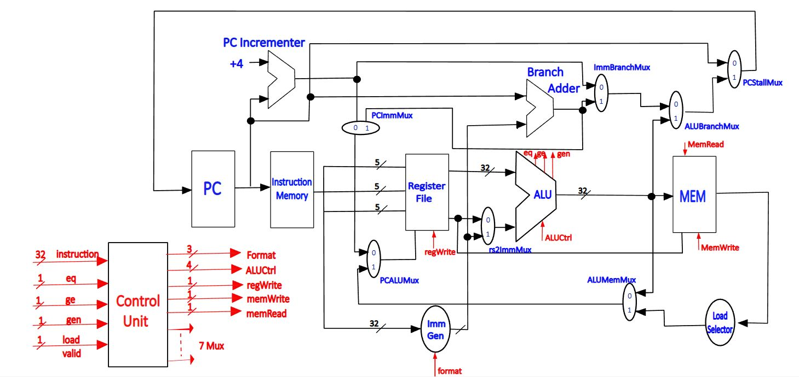

# **InFOS**: *RV32I* RISC-V PROCESSOR
This repository contains all the files associated with the design and implementation of a single-cycle Reduced Instruction Set Computer (RISC-V) processor, based on the RV32I instruction set architecture. The processor is implemented using Verilog Hardware Description Language and simulated using Verilator together with the GTKWave toolbox. The processor includes the basic RISC-V instruction set, including arithmetic, logical, and control flow instructions, and is capable of executing these instructions in a single clock cycle. The latter part of the work focuses on a cache controller design for a direct mapped cache bonded with a
fully associative victim cache.

### INSTRUCTION SET
The design suppots all 37 basic instructions included in RV32I instrction set.

## MICRO ARCHITECTURE
The processor design is completely based on a 32-bit architecture meaning that all the datapaths are 32-bit in size.

### CONTROL UNIT
The control unit is designed to echo the following flow of logic. First, it would read the opcode of the instruction and identify the corresponding instruction type. Then according to the instruction type, it would send the required signals to each module. The following shows the outputs of the control unit that would realize the above flow of logic.

## MEMORY HIERARCHY
Memory constitute of the design is as follows, 
1. 256 kB Primary Memory
2. 2 kB Primary Cache
3. 128 bytes Victim Cache
### DESIGN DECISIONS
Considering the availability of data in three distinguished places, the memory delay for data accessing varies randomly. So it is the task of the cache controller to indicate to the CPU the state of the data. Since in the following design data is always brought to the primary cache before accessing or modification, knowing when the data is ready in the cache is enough for the CPU to interact with memory. The implementation directly compares the primary cache tag when the particular primary cache line is valid and uses it as a ready signal for the CPU to proceed with the next operation. Hence, making sure the tag is get updated at the right time will indicate the readiness of the data to the CPU.

When the CPU request is a memory write operation, it is not necessary to keep the total processing unit in an IDLE state. The memory write operation can be performed parallelly. But it will be problematic when the CPU comes up with two subsequent write operations. As a way to tackle the issue, unlike in load, this implementation gives the CPU a wait signal which indicates the CPU to wait before proceeding to the next operation.
### EVICTION SELECTION
In the case of requesting a sapce from already filled victim cache, data spilling should be avoided by writing the dirty data line back to the memory. Under this regard, the method of choosing the block to be evicted is done under following rules,
- Keeping the controller aware of three most recently used blocks with a two bit tag.
- On the remaining five blocks controller will always search for dirty less line first. 
### CACHE CONTROLLER
Normally the contoller will be in **IDLE** state. When the CPU provides a valid read or write instruction,
1. The controller will check whether the data is available in the primary cache. Suppose the data is available and the instruction is of load type the controller will do nothing while allowing the CPU to access the data.
2. Suppose the data is available and the instruction is of write type, the controller will turn into **CACHE WRITE** state and allow the CPU to write into the cache while tracking the modification via a dirty flag unique to the line.
3. When there is a cache miss, the controller will search for the data inside the victim. Availability of the data into victim excites the cache into **VICTIM SWAP** state while allowing the data swap between the primary cache and victim cache. The controller is then forwarded to **IDLE** state.
4. Victim misses together with a cache miss, trigger the controller into either one of **WRITE BACK** state or **CACHE ALLOCATE** state based on whether the selected victim line is dirty. Where the victim line selection will happen according to an algorithm that always preserves the most recently used three lines.
5. On the **WRITE BACK** state, the dirty victim line will be written back into the memory and the controller is forwarded to **CACHE ALLOCATE** state. In this state, the data will be fetched from both memory and the CPU to put into the appropriate cache line according to the instruction.

# File References
1. [Final Report: InFOS](./FINAL_REPORT/Group12_INFOS_Processor_Design_Report.pdf)
2. [Core Design Files - Chisel](./PROCESSOR_CORE/src/main/scala/)
3. [Cache Design Files - Verilog](./CACHE/design_srcs/)